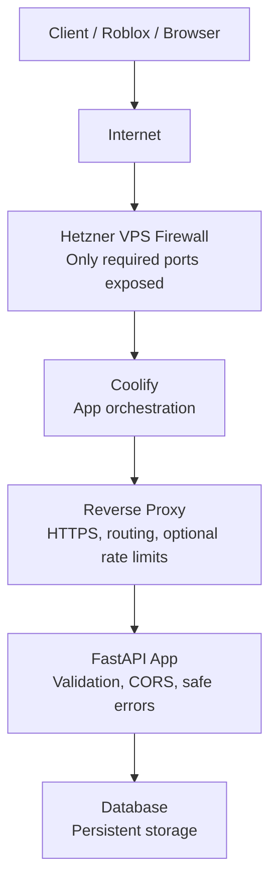
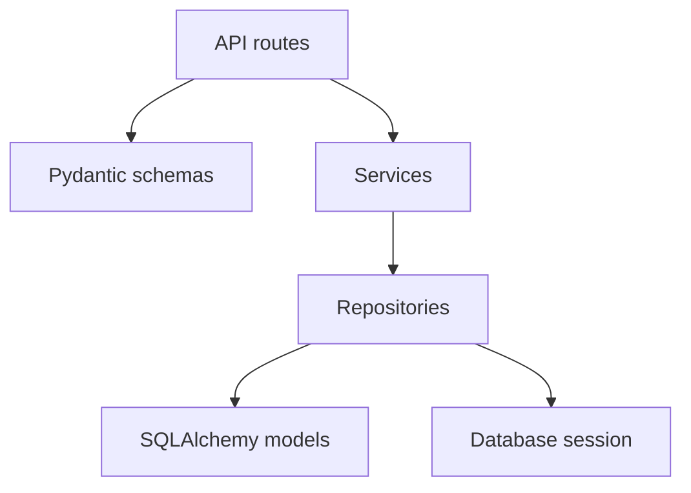

# Architecture

Vectolab is a FastAPI service for deterministic experiment assignment.

## Application Layers

## Responsibilities

Hetzner firewall limits network exposure. Coolify and the reverse proxy handle TLS, routing, compression, request size limits, and optional rate limiting. FastAPI owns validation, CORS, trusted hosts, safe errors, request IDs, business logic, and database access.
