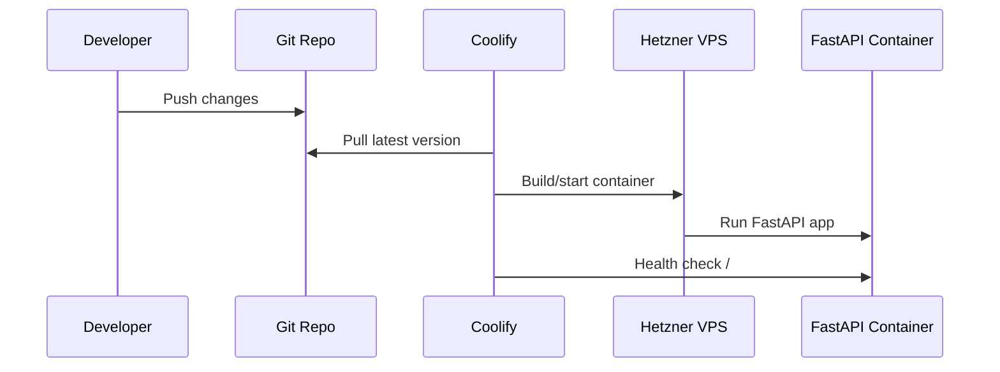

# Deployment

## Target

- Hetzner VPS
- Coolify-managed container
- FastAPI app running on port `4567`
- Reverse proxy routes public HTTPS traffic to the container

## Required Environment Variables

```bash
ENVIRONMENT=production
ALLOWED_HOSTS=api.example.com
ALLOWED_ORIGINS=https://app.example.com
ALLOW_CREDENTIALS=false
DATABASE_URL=sqlite:///./db/test.db
```

For a production database, replace `DATABASE_URL` with the managed/internal database URL.

## Deployment Flow


