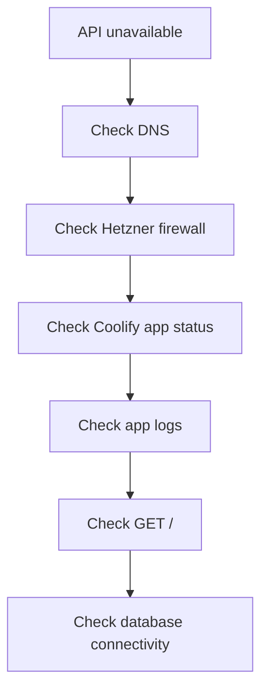

# Operations

## Common Checks

- Is the Coolify app running?
- Is the domain routed to the correct app?
- Is the TLS certificate valid?
- Are production environment variables set?
- Can the app reach the database?
- Do application logs show validation, database, or unexpected server errors?

## Incident Flow

